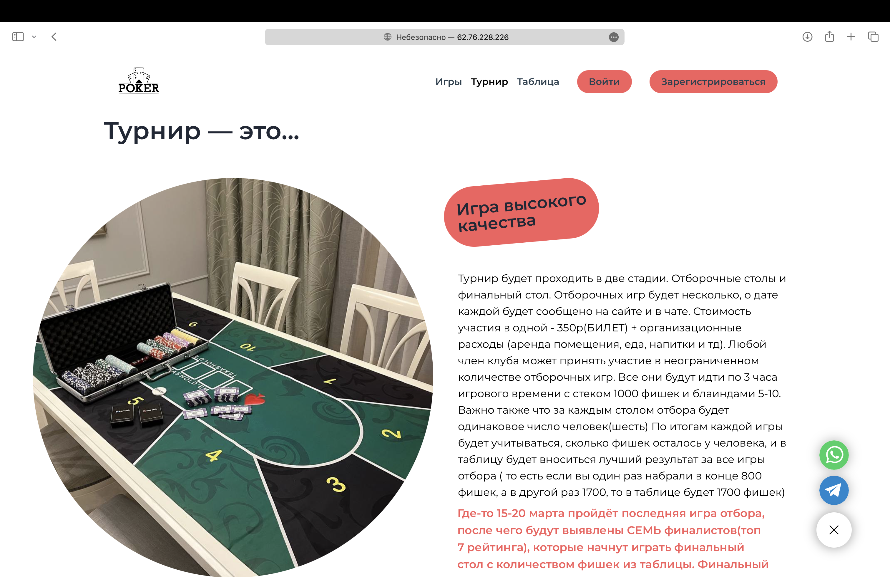
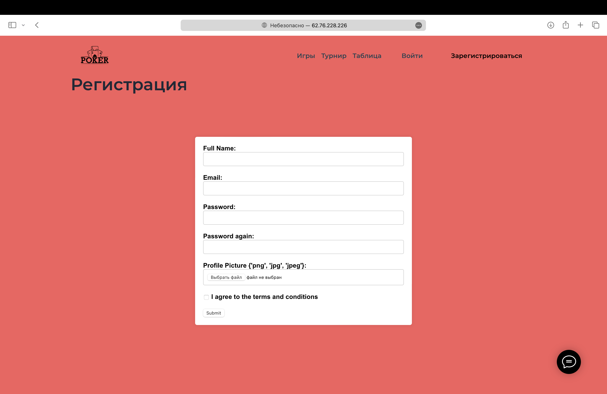

# Poker

## Description of Website Functionality

### Live Game Registration and Participation
- The website is not just a placeholder; it actively manages live game registrations.
- Registration for games is already accessible as user data is stored in a database, ensuring real-time updates.
- Users can easily sign up for games and manage their registrations within their account using session management for seamless user experience.

### Dynamic Game Management
- The administrator has the ability to create, modify, and remove games on-the-fly.
- Changes to the list of participants for each game are instantly reflected, providing up-to-date information for all users involved.

### Interactive User Experience
- Accepted accounts can swiftly register for games and cancel their participation directly on the website.
- All updates, including registration confirmations and cancellations, are promptly displayed, enhancing user engagement and interaction with the platform.
### Secure Account Verification
- Upon registration for a game, a unique verification code is sent to the user's email for account confirmation.
- If the verification code is not entered within a specified time frame, the user's registration details will not be saved, ensuring data security and preventing unauthorized account creation.
## Site Appearance

  
    
    
  

## Site Appearance for admin

    
    

### Members Page Appearance

    
    

### Registration and account Page Appearance

    
    

