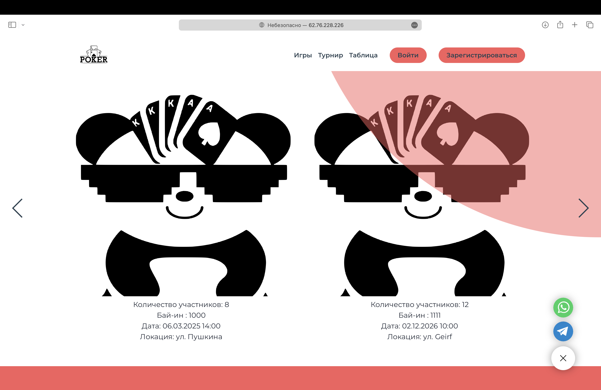
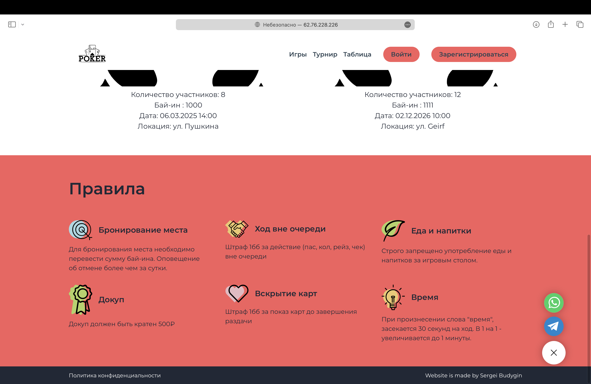
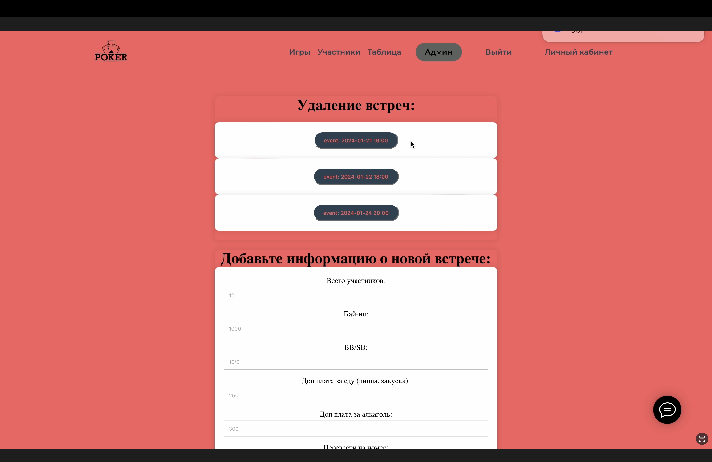
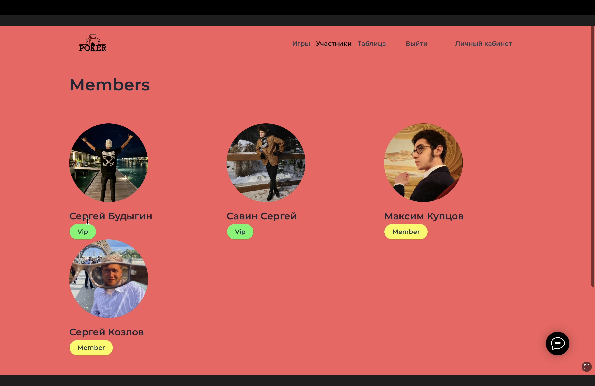
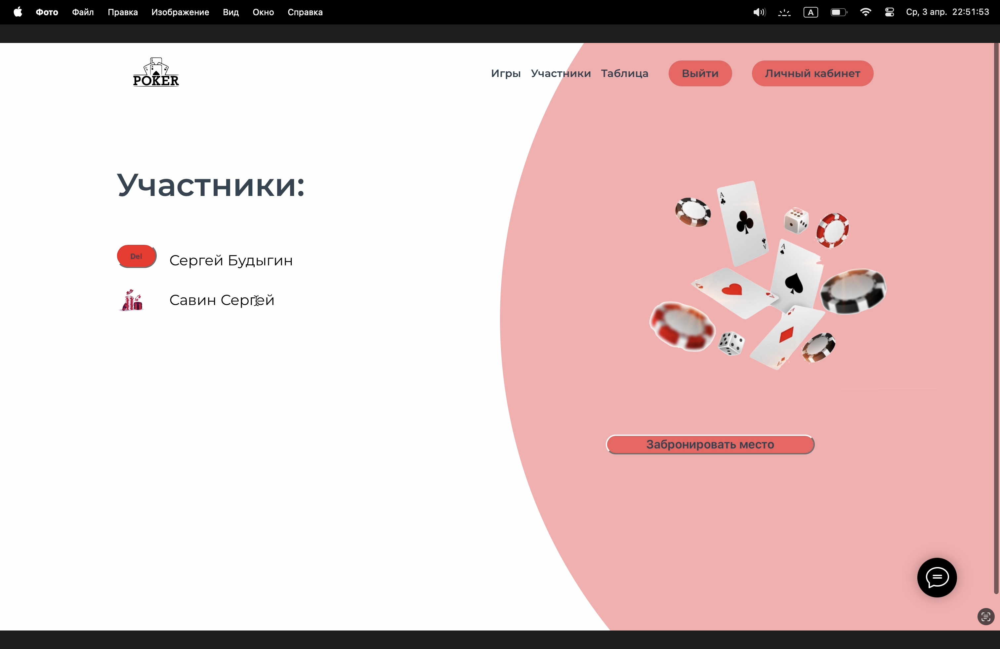
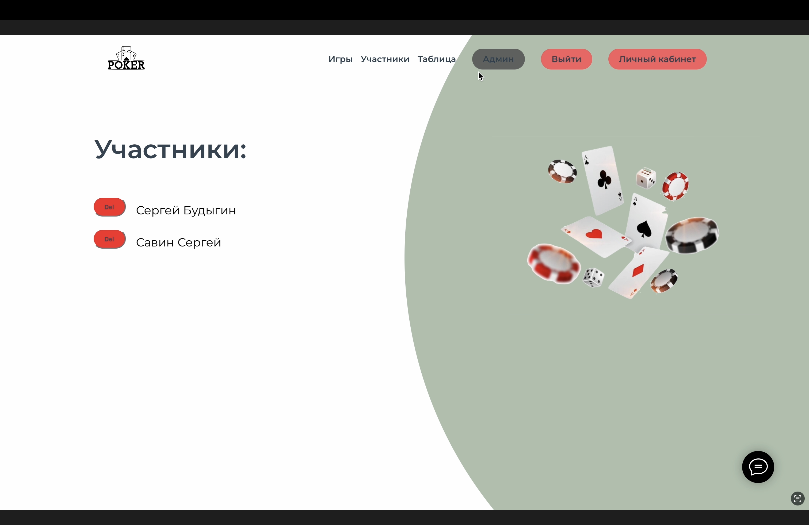
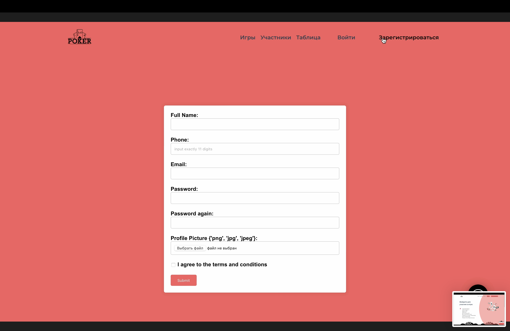
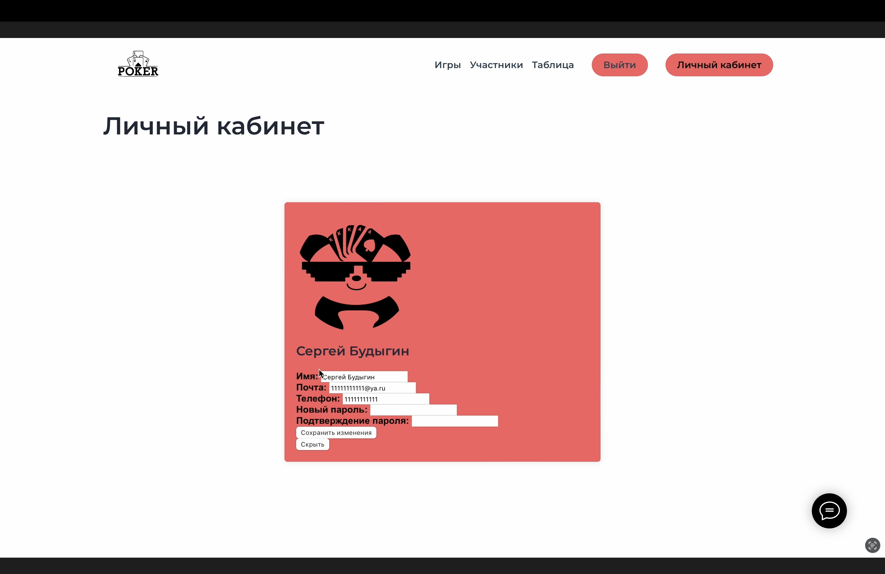

# Poker

## Description of Website Functionality

### Registration and Authentication
- Users can register by verifying their email through a confirmation code.
- Authentication is available after successful registration.
- The administrator confirms user accounts for access to games.

### Game Management
- The administrator can create, edit, and delete games.
- Changing the list of participants for each game is possible.

### Registration for Games
- Registered users can sign up for games in real-time.
- Cancellation of registration is also available and displayed on the site.

## Site Appearance

### Example Registration Page Appearance

### Example Administrator Page Appearance

### Example Administrator Page Appearance

